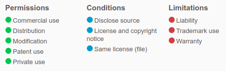

# Robosane ED24
### Robosane's Joomla Template

Take a look at this template in action at https://www.robosane.net/

Features:
 * Mobile native experience
 * Desktop/touchscreen all resolution support
     - Please use SVGs for HiDPI support!
 * Bootstrap based, open code base
 * Designed with help from Chrome Dev Tools
 * Works in most browsers (over 96% globally, 99.9% in the USA, http://caniuse.com/ )
     - If something doesn't work, make a bug report or PR!

Before making this your default template for a site, we recommend testing it out on a dev site. It completely overhauls the naming for Joomla positions, and you may want to change some things before making it live.

#### Notes:
 * All bootstrap override CSS is mainly in `css/robosane-ed24.css`.
 * If needed, the template includes it's own versions of bootstrap and jQuery that are known to work, simply switch the includes in index.php if the Joomla ones don't work.
 * This template overrides a few things to fix bugs:
     - Chosen `chzn-containers` that are zero width are set to auto. Because of [this bug](https://github.com/harvesthq/chosen/issues/92).
     - The MooTools show/hide function was conflicting with something using jQuery (causing menus to disappear when clicked), the functions have been overridden in `js/template.js`.

### License:

This project uses the *Mozilla License*, which implies a few things,

 * Although the template itself is open source, our trademarks aren't. Please don't use our branding if you are not representing us.
 * Although you can use this template for private use, we would prefer that if you make modifications you would make them public, or tell us about it, that way we can improve the template for all users.

This template took time and effort, so I would appreciate it if you left feedback, criticisms, or thanks!
